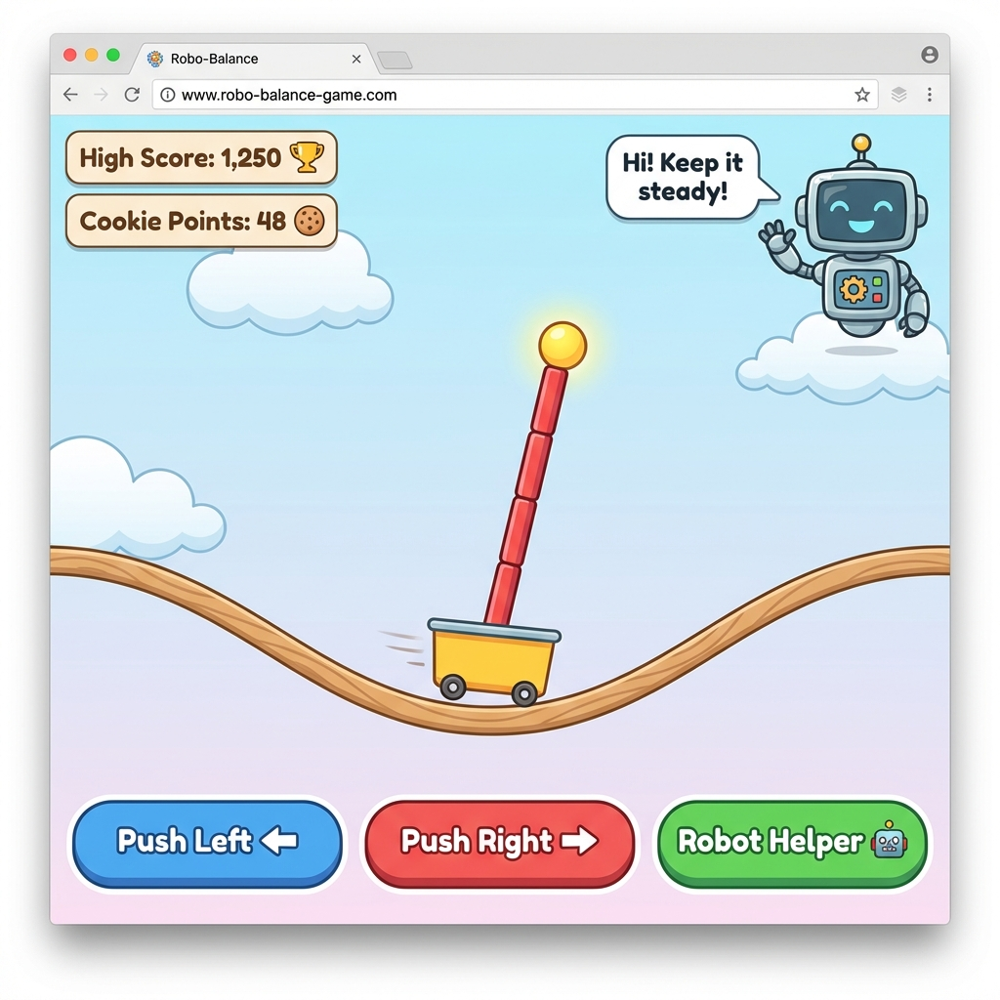
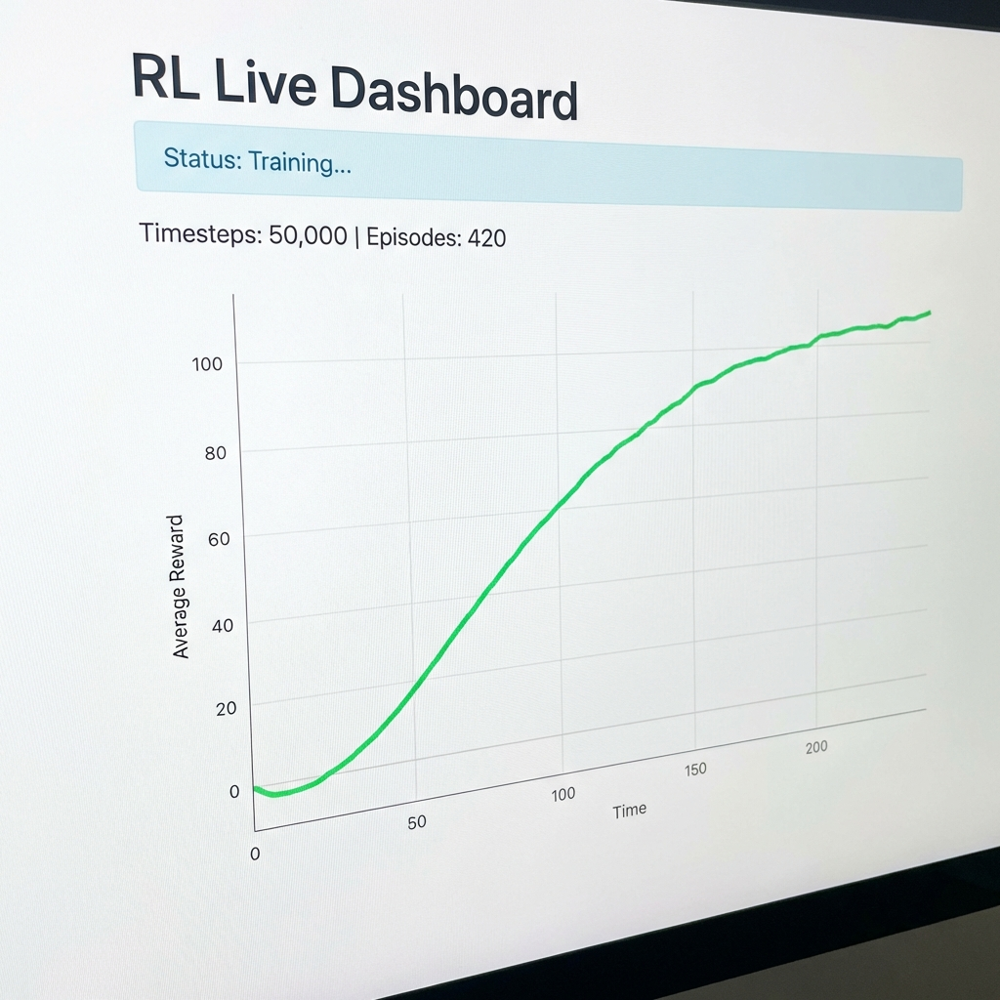

# RL Dashboard & CartPole Game 🤖🎪

Welcome to the **RL Dashboard** project! This repository contains a fun, interactive web-based implementation of the classic **CartPole** reinforcement learning problem, designed to be playable by humans (and robots!).

## ⚡ 1-Minute Demo

### The Game (Human vs AI)
Play manually or let the Robot Helper take over!


### The AI Training Dashboard
Watch your AI agent get smarter in real-time.


## 🛠️ Technology
- **HTML5 Canvas**: For smooth, 60fps physics rendering.
- **Vanilla JavaScript**: No heavy frameworks, just pure code.
- **CSS3**: Modern styling with gradients, shadows, and animations.
- **Python (Gymnasium + Stable-Baselines3)**: For industrial-grade AI training.
- **FastAPI / Uvicorn**: A lightweight server to visualize training data.

## 📦 Installation

To run the Python components (Training & Server), set up your environment:

1. **Create and Activate a Virtual Environment** (Recommended):
   ```bash
   # Windows (PowerShell)
   .\venv\Scripts\Activate.ps1

   # Windows (cmd)
   .\venv\Scripts\activate.bat

   # Mac/Linux
   python3 -m venv venv
   source venv/bin/activate
   ```

2. **Install Dependencies**:
   ```bash
   pip install -r requirements.txt
   ```

---

## 🚀 Getting Started (Choose Your Lane)

### Lane 1: Just Playing 🎮
**Goal**: Have fun, no coding required.
1. Open `rl_cartpole_details.html` in any web browser (Chrome, Edge, Firefox).
2. Use **Arrow Keys** to balance the pole.
3. Click **"Robot Helper"** to see the AI play!

### Lane 2: Monitoring the Dashboard 📊
**Goal**: View the charts and valid training metrics.
1. Activate your venv (see Installation).
2. Start the server:
   ```bash
   uvicorn server:app --reload
   ```
3. Open `http://127.0.0.1:8000` in your browser.
   *(Note: The chart updates automatically when `metrics.json` changes)*

### Lane 3: Training Your Own AI 🧠
**Goal**: Run the actual training loop and produce data.
1. Activate your venv.
2. In a **new terminal**, run:
   ```bash
   python train.py
   ```
3. Watch the terminal for progress bars and the Dashboard for graphs!

---

## 🔄 Data Pipeline (How it Works)
1. **`train.py`**: Runs the PPO algorithm. Every 1,000 steps, it writes the latest stats (rewards, episodes) to `metrics.json`.
2. **`metrics.json`**: Acts as the shared data bridge.
3. **`server.py`**: Reads `metrics.json` and serves it as a JSON API endpoint (`/metrics`).
4. **Dashboard (Frontend)**: Periodically fetches `/metrics` and updates the Live Chart.

---

## ❓ Common Issues

### 1. "uvicorn not found"
*   **Fix**: Ensure your virtual environment is activated (`(.venv)` should be in your prompt) and you ran `pip install -r requirements.txt`.

### 2. "PermissionDenied" running Activate.ps1
*   **Fix**: Windows restricts scripts by default. Run this in PowerShell as Administrator:
    ```powershell
    Set-ExecutionPolicy -ExecutionPolicy RemoteSigned -Scope CurrentUser
    ```

### 3. Pygame window not opening / crashes
*   **Fix**: Make sure you have a display environment (this won't work in headless cloud servers). Locally, ensure `pip install pygame` ran successfully.

### 4. Dashboard says "Status: waiting..."
*   **Fix**: This means `metrics.json` doesn't exist yet. Run `python train.py` for a few seconds to generate the first batch of data!
